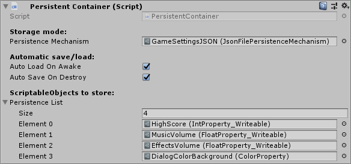
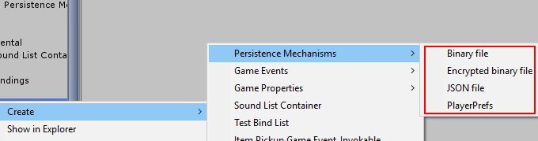

# Persistent ScriptabeObject container for Unity3D

**Supports saving into PlayerPrefs, JSON file, binary file or AES-encrypted file.**

----
### Status: Not stable. Actually currently quite broken due to the difficulty of getting hold of [persistent asset IDs in Unity](#current-problem). I'm short on time these days, but will try to work out a decent solution.
----

This is a submodule I developed for my own projects. New addition, still under development. But if you find it useful, feel free to use it for any purpose.

'Transparent' means you don't have to call any of save or load methods:

- **Automatic state save:** The states of the selected  `ScriptableObjects` are automatically serialized and stored through the selected persistence mechanism.
  - **When?** When `OnDestroy()` triggers on the container.
- **Automating state restore:** The state is automatically restored when the persistent container is instantiated.
  - **When?** When `Awake()` triggers on the container.

(But optionally you can disable this automatic save and restore, and call the publicly exposed simple `SaveData()` and `LoadData()` methods on the `PersistentContainer` instance.)

The *persistence mechanism* mentioned above is essentially a `ScriptableObject`-based plug-and-play component you can drag into the appropriate slot on the `PersistentContainer`. This component determines how and where the state of your `ScriptableObjects` will be saved.

## Interface

*Simple example use with granular, single-variable `ScriptableObjects`. See [Unity3D-ReactiveScriptables](https://github.com/baratgabor/Unity3D-ReactiveScriptables) for more information on this approach. You can use it with traditional, large state `ScriptableObjects` too.* 

## Usage 101

1. #### Add the `PersistentContainer` component to a gameobject.

2. #### Drop some `ScriptableObjects` into the container.

## Usage detailed

1. **Create a container:** Add the `PersistentContainer` component to a `GameObject` in your scene (for example to the object responsible for scene management, or an object marked with `DontDestroyOnLoad`).

2. **Create a persistence mechanism:** Create a `PersistenceMechanism` by right clicking in the project tree, selecting **Create** > **Persistence Mechanisms**, then one of the available mechanisms:

   

3. **Set a filename (optional):** If you created a file-based persistence mechanism, you can specify the **filename** to use on the Inspector pane of the persistence mechanism itself.

4. **Fill the container:** Drag the `ScriptableObjects` you want to save into the **Persistence List** array of the `PersistentContainer` component.

## Current problem

**The unique and persistent identification of instances is currently broken.**

Initially, like a proper moron, I used `GetInstanceId()` on the `ScriptableObject` instances to get hold of a unique identifier. I assumed this is the equivalent of the persistent GUIDs Unity uses for assets – but nope, the `InstanceId` is in fact not guaranteed to be persistent.

I spent some time researching solutions to actually get the GUIDs, but to my surprise there appears to be none. So I temporarily refactored the container to use the type and instance name of the `ScriptableObjects`, which is just horrid, since even renaming them breaks the persistence.

I really want to keep the container universal, i.e. not requiring any sort of special ID field to be implemented on the contained objects.

## Implementation details

### Fail-safe against data loss

I made some efforts to add a fail-safe against potential data loss: The persistence system *does not delete orphaned saved data*; it continues to store it.

What this means is that if you remove an item from the container, or an item gets detached from the saved state for any reason (e.g. identification breaks), the container will continue to store the previously saved data of the item. If you put the item back (with identification intact), the container will resume loading the state for it.

I don't know what would be the best way to granularly handle these orphaned data; what I know is that I'll implement at least a `Purge()` method to clear the storage.

### Other notes

You can also transform stored state from one format to another if you replace the persistence mechanism while the data is already loaded, and you execute a save. 

The system is not exactly optimized for handling large amounts of data, since it keeps stuff in memory, but I'll push it into that direction to cover these usage scenarios too.

Oh yes, the AES-128 encryption is sort of a lazy implementation. The key is generated from a string key that the container itself provides for the persistence mechanism; it's always the same key (per container). And the IV is prepended in cleartext to the written encrypted data (but that's actually fine).
